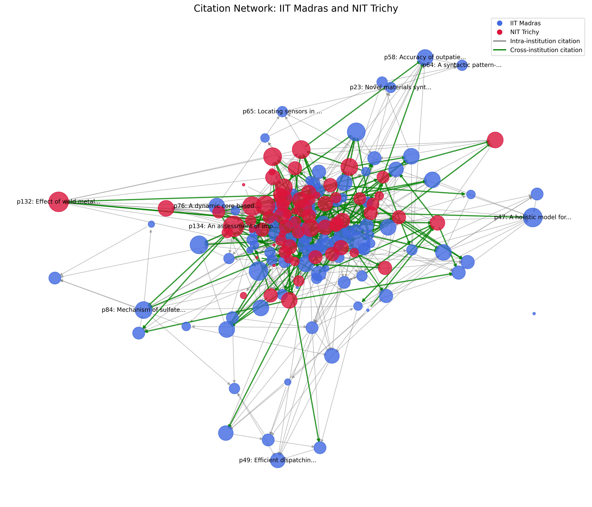

# Citation Network Analysis for IIT Madras & NIT Trichy

This repository provides a complete analysis of citation networks between **IIT Madras** and **NIT Trichy** using **NetworkX, Scholarly API, and Matplotlib**. The project fetches data from Google Scholar, constructs a directed citation network, analyzes key centrality metrics, and visualizes the results.

## Features
- **Fetch Google Scholar Data**: Retrieve research papers of professors from IIT Madras & NIT Trichy.
- **Build Citation Network**: Construct a directed graph where nodes are papers and edges represent citations.
- **Compute Network Metrics**:
  - Eigenvector Centrality
  - Betweenness Centrality
  - Closeness Centrality
  - PageRank
  - HITS Algorithm (Hubs & Authorities)
- **Visualizations**:
  - Citation Network Graph
  - Institution Citation Matrix (Heatmap)
  - Professor Citation Bar Chart
  - Yearly Citation Trends
  - Centrality Distributions

## Installation
Clone this repository and install the required dependencies:
```bash
git clone https://github.com/yourusername/citation-network-analysis.git
cd citation-network-analysis
pip install -r requirements.txt
```

## Usage
### 1. Run Full Analysis
```bash
python app.py
```
This will:
- Fetch or load network data
- Construct a citation network
- Analyze centrality metrics
- Generate plots and a report

### 2. Generate a Report
```bash
python report_generator.py
```
The report will be saved in the `outputs/` directory.

### 3. View Metrics Visualization
```bash
python visualize_metrics.py
```

## Project Structure
```
📂 citation-network-analysis
 ├── app.py                  # Main script for analysis
 ├── report_generator.py      # Generates a text-based report
 ├── visualize_metrics.py     # Visualizes network statistics
 ├── utils.py                 # Helper functions (saving plots, etc.)
 ├── requirements.txt         # Python dependencies
 ├── 📂 plots                 # Stores generated visualizations
 ├── 📂 outputs               # Stores reports and data outputs
```

## Example Output
**Citation Network Visualization**


## Future Improvements
- Implement **machine learning-based** citation predictions
- Expand to more institutions
- Enhance citation retrieval from Google Scholar

## License
This project is licensed under the MIT License.

---
Developed by **Your Name**

